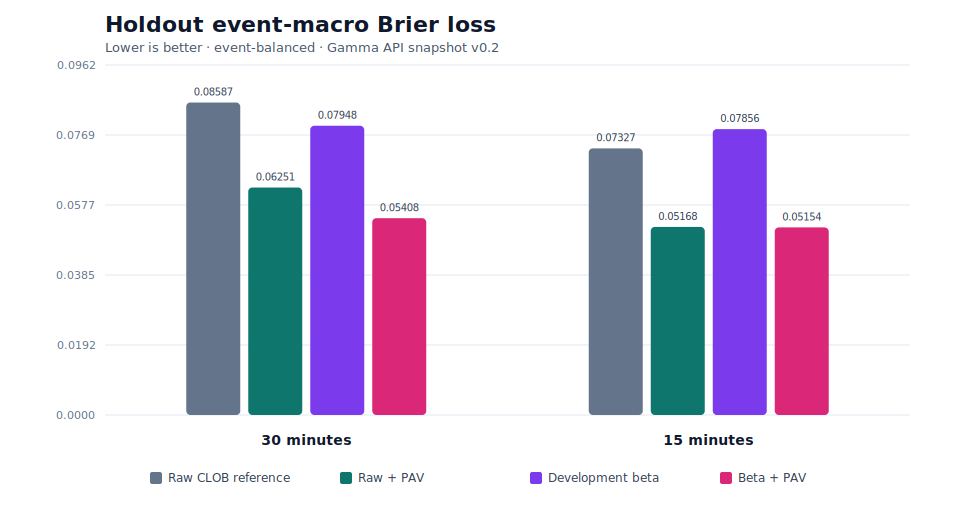

# EventFactorBench

[](https://github.com/bihraint-oss/event-factor-bench/actions/workflows/ci.yml)
[](LICENSE)

EventFactorBench is a reproducible benchmark for shape-constrained probability factors on
Polymarket threshold ladders. It combines prediction-market data engineering, label-free
isotonic projection, calibrated baselines, chronological holdout evaluation, and paired
hierarchical bootstrap inference.

## Headline result

On the public v0.2 Gamma snapshot, **non-increasing PAV reduced 30-minute holdout event-macro
Brier loss by 27.20%**, from **0.08587 to 0.06251**. The paired 95% UTC-day/event bootstrap
interval for the absolute reduction was **[0.02137, 0.02559]**.

- 67,156 forecast rows
- 1,877 events and 33,784 markets
- 597-event, 14-day primary holdout
- 10,000 paired hierarchical bootstrap resamples
- positive PAV improvement in both Bitcoin and Ethereum subgroups
- 1,596 holdout monotonicity violations reduced to zero at 30 minutes

> Outcomes are retrospective terminal Polymarket Gamma `outcomePrices` labels. They were not
> independently verified on Polygon. This release is a descriptive probability-quality
> benchmark, not a canonical-chain result or a trading/P&L backtest.



## Holdout comparison

| Horizon | Method | Event-macro Brier | Relative change vs raw | Violation edges |
|---:|---|---:|---:|---:|
| 30 min | Raw CLOB reference | 0.08586873 | — | 1,596 |
| 30 min | Raw + PAV | 0.06251235 | **−27.20%** | **0** |
| 30 min | Development beta | 0.07947659 | −7.44% | 1,596 |
| 30 min | Beta + PAV | 0.05408174 | **−37.02%** | **0** |
| 15 min | Raw CLOB reference | 0.07326594 | — | 1,534 |
| 15 min | Raw + PAV | 0.05167655 | **−29.47%** | **0** |

Full metrics, intervals, coverage, and subgroup results are in [RESULTS.md](RESULTS.md). The
machine-readable source of truth is
[`results/gamma_snapshot_v0.2/results.json`](results/gamma_snapshot_v0.2/results.json).

## What the benchmark tests

Polymarket publishes separate probabilities for thresholds such as “Bitcoin above 72,000” and
“Bitcoin above 72,200.” Those probabilities should be non-increasing as the threshold rises, but
independently traded contracts can violate that shape constraint.

The primary factor applies unweighted non-increasing pooled-adjacent-violators (PAV) projection
to each event ladder. PAV sees only thresholds and point-in-time probabilities; it never reads
outcomes. The benchmark compares:

- raw CLOB reference probabilities;
- raw probabilities followed by PAV;
- event-balanced Platt calibration;
- event-balanced beta calibration;
- beta calibration followed by PAV.

Calibration models fit only on the development split. Validation and holdout labels never enter
model fitting.

## Dataset

The release includes the exact normalized snapshot and its collector provenance manifest:

| Artifact | Value |
|---|---|
| Snapshot | [`data/gamma_snapshot_v0.2.csv.gz`](data/gamma_snapshot_v0.2.csv.gz) |
| Collector manifest | [`data/gamma_snapshot_manifest_v0.2.json`](data/gamma_snapshot_manifest_v0.2.json) |
| Compressed SHA-256 | `0e0af86d8f87cb55c0a77337439b6ede95bc3440c86735faf4f689b49ad5202a` |
| Content SHA-256 | `e703dff2a94f60ef3e6bd8d94240375a20f0a0a320c95e9f4adafc452e5e9c87` |
| Collector manifest SHA-256 | `0fc7a29f536a43e5ba4ab9f391cf121994ef23d30717a8665f4cf8f78594c1e1` |
| Discovery window | 2026-06-01 through 2026-07-13 UTC |
| Assets | Bitcoin and Ethereum |
| Forecast horizons | 30 minutes and 15 minutes |

Every row records the forecast cutoff, source timestamp, staleness, event/market identifiers,
source-response hashes, Gamma label source, and `gamma_candidate_label_onchain_verified=False`.
The evaluator rejects changed hashes, future information, stale observations, duplicate rows,
incomplete ladders, inconsistent cross-horizon labels, or any claim that these labels were
on-chain verified.

Raw Gamma/CLOB response bytes are not redistributed. The manifest retains 2,006 request records
and content hashes so the public table remains tied to the collection run without becoming a raw
API mirror.

## Evaluation design

| Component | Frozen choice |
|---|---|
| Development | 2026-06-01 to 2026-06-19 UTC |
| Validation | 2026-06-20 to 2026-06-29 UTC |
| Holdout | 2026-06-30 to 2026-07-13 UTC |
| Primary metric | Event-macro Brier loss at 30 minutes |
| Secondary metric | Event-macro log loss |
| Statistical unit | Event |
| Dependence block | UTC calendar day |
| Confidence interval | Paired day/event percentile bootstrap |
| Bootstrap resamples | 10,000, seed 260715 |

Event-macro scoring gives every event equal weight, so a ladder with many thresholds cannot
dominate the result. The chronological split prevents calibration leakage, and the paired
bootstrap preserves the comparison between raw and projected forecasts within the same events.

## Reproduce locally

Requirements: Python 3.11–3.13 and [uv](https://docs.astral.sh/uv/).

```bash
git clone https://github.com/bihraint-oss/event-factor-bench.git
cd event-factor-bench
uv sync --frozen --all-groups
make verify-api-release
```

`make verify-api-release` performs three offline checks:

1. validates the public CSV, source hashes, time boundaries, labels, ladders, and manifest;
2. recomputes all models, metrics, bootstrap intervals, and subgroup results;
3. verifies that JSON, CSV, SVG, and Markdown artifacts match the recomputed result exactly.

To regenerate the committed result from the public snapshot:

```bash
rm -rf results/gamma_snapshot_v0.2 RESULTS.md
make score-api-snapshot
make render-api-snapshot
make verify-api-release
```

The same verification runs in GitHub Actions on Python 3.13; the package test suite runs on both
Python 3.11 and 3.13.

## Repository map

```text
data/                         public snapshot + collector provenance
results/gamma_snapshot_v0.2/ machine-readable result, metrics CSV, SVG
src/event_factor_bench/       PAV, calibration, metrics, bootstrap core
scripts/evaluate_api_snapshot.py
                              snapshot validation + deterministic evaluation
scripts/render_results.py     deterministic Markdown/CSV/SVG rendering
tests/                        fail-closed unit and integration tests
configs/protocol_v0.1.json    original statistical design
```

The earlier `protocol-v0.1` and `protocol-v0.1.1` tags preserve the experimental on-chain-freeze
design. The v0.2 public result deliberately uses the documented Gamma snapshot path instead; the
reported metrics do not depend on the unfinished chain-freeze workflow.

## Scope limits

EventFactorBench measures retrospective forecast quality under a versioned snapshot. It does not
claim:

- realized P&L or tradable alpha;
- executable fills, fees, slippage, latency, or market impact;
- that PAV “beats Polymarket” as a venue;
- independently verified canonical on-chain outcomes;
- causal evidence that shape repair improves future live trading.

See [BENCHMARK_CARD.md](BENCHMARK_CARD.md), [CLAIM_GATE.md](CLAIM_GATE.md), and
[THIRD_PARTY.md](THIRD_PARTY.md) for the complete protocol, reporting, and data-licensing notes.

## License

Code and original documentation are MIT licensed. Third-party data remains subject to its source
terms. Polymarket and Polygon do not sponsor or endorse this benchmark.
